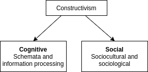

---
keywords:
  - teaching, active-learning
---

# Lombardi et al. 2021

#active-learning #sotl #dber #stem-teaching #stem-education #student-agency 

>Lombardi, D., Shipley, T. F., & Astronomy Team, Biology Team, Chemistry Team, Engineering Team, Geography Team, Geoscience Team, and Physics Team. (2021). The curious construct of active learning. Psychological Science in the Public Interest, 22(1), 8-43.

+ Overview
    + There's a lot of variation in what people refer to as "Active learning"
    + Common denominators: 
        + "it involves students taking con-trol of their learning through some level of metacognitive sense making, self-assessment, and reflection"
        + "nested within the two familiar pedagogical approaches of student-centered and iniry-based learning"
    + Questions
        + What characterizes effective learning processes in undergraduate STEM fields, and what role does active learning play in these processes?
        + What concrete guides have emerged from active-learning research that elucidate promising practices in undergraduate STEM instruction?
        + Are there active-learning strategies that optimize learning in some situations but not others?
        + Is lecture inherently flawed? Or are there some situations where students can active learn during a lecture? 
+ **Takeaways**
    + "Active learning" used as an umbrella term to mean basically "anything that isn't lecture" isn't helpful in advancing research on STEM teaching
    + **Construction-of-understanding ecosystem"** – putting specific forms of active learning into a framework
    + The value of an active learning instructional strategy is an open question 
    + Cornerstone: Undergraduate learners should be active agents during instruction 
    + "the social construction of meaning plays a key role for many learners, above and beyond the individual cognitive construction of knowledge"; traditional lecture puts the entire package of sense-making in the hands of the individual, which may privilege fewer learners 
        + _Interesting, lecture is basically forcing each student to teach themselves_ 
+ Constructivism
  + Different researchers adopt cognitive constructivism while others social constructivism -- but many don't make any distinction at all that this leads to confusion. 
  + 

>We drew from each discipline to construct a synthetic working definition: Active learning is a classroom situation in which the instructor and instruc-tional activities explicitly afford students agency for their learning. 

Later: Activity that parallels the discovery of knowledge practiced by the professions (scientific discovery, mathematical investigation, etc.)