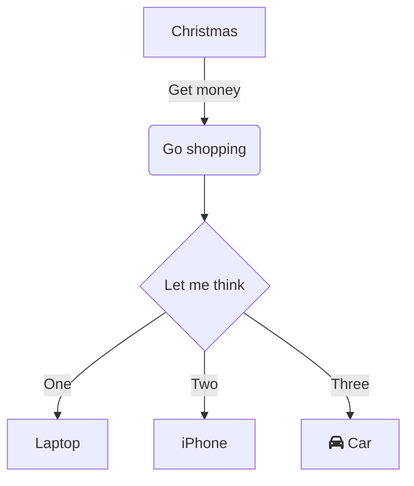

# This is a heading

```python
def fib(n):
	if n == 0: return 1
	elif n == 1: return 1
	else: return f(n-1) + f(n-2)
```




[My website](http://rtalbert.org)

| Heading | x | y | 
| ------- | -- | -- | 


[[Course prep notes]]

~~strike~~

==highlight== 


![[Pasted image 20220623195713.png]]
<iframe width="560" height="315" src="https://www.youtube.com/embed/Zl_dTUsrU9s" title="YouTube video player" frameborder="0" allow="accelerometer; autoplay; clipboard-write; encrypted-media; gyroscope; picture-in-picture" allowfullscreen></iframe>


![[Volumetric Video Capture.pdf]]